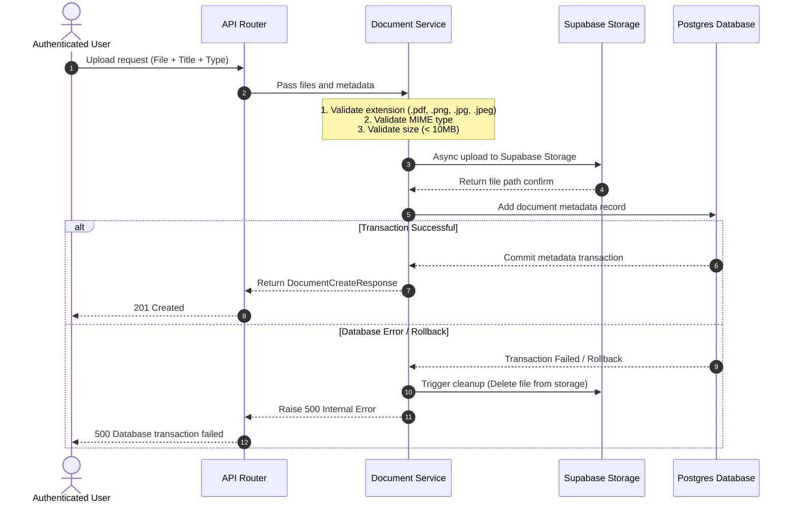

# Walkthrough: Document Management Module Backend Setup & Architecture

This guide describes how to configure, set up, and test the **Document Management Module** backend. It outlines everything from configuring Supabase Storage to understanding the core execution flows of the code.

---

## 1. Setup & Requirements

Before using or testing this module, the following configurations are required in your Supabase project and local environment.

### A. Supabase Project Configuration
1. Go to your **Supabase Dashboard** and navigate to **Storage**.
2. Click **New Bucket**.
3. Set the Name of the bucket to exactly: `vaultpass-documents`
4. Set the Bucket Privacy to **Private** (uncheck "Public"). 
   * *Why?* This ensures that documents (such as passports and certificates) are secure and cannot be accessed via public links. Only authorized users can download them through temporary signed URLs.

### B. Environment Variables Setup
You need a service role key to perform storage operations (like uploading, deleting, and signing URLs) from the backend while bypassing Supabase Row Level Security (RLS) policies.

1. Navigate to **Project Settings** > **API** in the Supabase Dashboard.
2. Locate the **Project URL** and the **`service_role` key** (labeled `service_role` / `secret`). *Do not use the `anon`/`public` key.*
3. Open or create the `vaultpass_backend/.env` file and add the settings:

```env
# Supabase Storage settings
SUPABASE_URL="https://your-supabase-project-id.supabase.co"
SUPABASE_SERVICE_ROLE_KEY="your-supabase-secret-service-role-key"
```

---

## 2. Database Schema & Migrations

The database table `documents` maps document metadata to PostgreSQL.

### Migration Discovery
The migration script is generated and located in:
[3fbdfb2d0dec_create_documents_table.py](file:///e:/gdev/projects/vault%20pass/vaultpass/vaultpass_backend/alembic/versions/3fbdfb2d0dec_create_documents_table.py)

### Applying Migrations
There are two ways to apply migrations:
1. **App Startup (Lifespan)**: The backend is configured to automatically apply Alembic migrations on startup in [main.py](file:///e:/gdev/projects/vault%20pass/vaultpass/vaultpass_backend/src/vaultpass_backend/main.py) via `run_migrations`. Simply run the FastAPI server, and it will update the schema automatically.
2. **Manual Command**: You can run migrations manually via terminal:
   ```bash
   poetry run alembic upgrade head
   ```

---

## 3. Core Architecture & Execution Flows

### A. File Upload Flow (`POST /api/documents/upload`)


* **Storage Path**: Files are saved in the bucket as `owner_id/uuid_filename` to prevent duplicates and path traversal attacks.
* **Error Cleanup**: If metadata saving fails after a file is uploaded, the service triggers an automatic cleanup task to delete the uploaded file from Supabase storage, preventing storage leakage.

### B. List Documents & Search Flow (`GET /api/documents`)
* Fetches all documents where `owner_id == current_user.id`.
* Supports pagination query parameters `page` and `limit`.
* Supports search filtering by document `title` utilizing case-insensitive matching (`ilike`):
  ```python
  search_filter = Document.title.ilike(f"%{search}%")
  ```

### C. Details & Download Link Flow (`GET /api/documents/{id}/download`)
* Checks ownership constraints: returns `403 Forbidden` if another user attempts to retrieve the document, or `404 Not Found` if it does not exist.
* Generates a secure, temporary (1-hour expiry) signed URL using Supabase:
  ```python
  signed_url = await storage_service.generate_signed_url(doc.file_path, expires_in_seconds=3600)
  ```

### D. Update Flow (`PUT /api/documents/{id}`)
* Validates ownership constraints.
* Allows updating details like `title`, `description`, `document_type`, or `expiry_date`.
* Updates only non-null fields to support partial modifications.

### E. Delete Flow (`DELETE /api/documents/{id}`)
* Validates ownership constraints.
* Deletes the file from Supabase Storage first.
* Deletes the metadata record from the Postgres database and commits the transaction.

---

## 4. How to Run the Tests

To ensure code stability, a comprehensive unit and integration test suite is located in [test_documents.py](file:///e:/gdev/projects/vault%20pass/vaultpass/vaultpass_backend/tests/test_documents.py). It mocks external APIs (like Supabase and connection interfaces) while verifying endpoint routers, file validations, page parameters, and owner access validations.

Run the test suite using Poetry:
```bash
poetry run pytest
```
All tests should pass successfully.

---

# Walkthrough: Audit Logging Module

This section describes the complete audit logging system added on top of the existing backend.

---

## 1. Architecture Overview

The audit module follows the same layered pattern as the rest of the codebase:

```
API Router (audit_logs.py)
    └── AuditService (audit_service.py)
            └── AuditLogRepository (repository/audit_log.py)
                    └── AuditLog ORM Model (models/audit_log.py)   ← already existed
```

Audit entries are written **fire-and-forget**: if the database insert fails for any reason, the error is caught and logged as a warning — it never propagates up to the caller, so a logging hiccup cannot break a real user request.

---

## 2. New Files

| File | Role |
|---|---|
| [`schemas/audit_log.py`](file:///e:/gdev/projects/vault%20pass/vaultpass/vaultpass_backend/src/vaultpass_backend/schemas/audit_log.py) | Pydantic response models (`AuditLogResponse`, `AuditLogListResponse`) |
| [`repository/audit_log.py`](file:///e:/gdev/projects/vault%20pass/vaultpass/vaultpass_backend/src/vaultpass_backend/repository/audit_log.py) | DB queries: `create`, `get_by_id`, `get_user_logs`, `count_user_logs` |
| [`services/audit_service.py`](file:///e:/gdev/projects/vault%20pass/vaultpass/vaultpass_backend/src/vaultpass_backend/services/audit_service.py) | `log_action()` fire-and-forget helper + `get_user_logs()` for the API |
| [`api/audit_logs.py`](file:///e:/gdev/projects/vault%20pass/vaultpass/vaultpass_backend/src/vaultpass_backend/api/audit_logs.py) | `GET /api/audit-logs` router with pagination & filtering |
| [`tests/test_audit_logs.py`](file:///e:/gdev/projects/vault%20pass/vaultpass/vaultpass_backend/tests/test_audit_logs.py) | 11 unit + integration tests (all passing) |

---

## 3. Modified Files

| File | Change |
|---|---|
| [`main.py`](file:///e:/gdev/projects/vault%20pass/vaultpass/vaultpass_backend/src/vaultpass_backend/main.py) | Imports and registers `audit_logs_router` at `/api/audit-logs` |
| [`repository/__init__.py`](file:///e:/gdev/projects/vault%20pass/vaultpass/vaultpass_backend/src/vaultpass_backend/repository/__init__.py) | Exports `AuditLogRepository` |
| [`services/__init__.py`](file:///e:/gdev/projects/vault%20pass/vaultpass/vaultpass_backend/src/vaultpass_backend/services/__init__.py) | Exports `AuditService` |
| [`schemas/__init__.py`](file:///e:/gdev/projects/vault%20pass/vaultpass/vaultpass_backend/src/vaultpass_backend/schemas/__init__.py) | Exports `AuditLogResponse`, `AuditLogListResponse` |
| [`api/auth.py`](file:///e:/gdev/projects/vault%20pass/vaultpass/vaultpass_backend/src/vaultpass_backend/api/auth.py) | Logs `REGISTER` and `LOGIN` events with IP address + user-agent |
| [`services/document_service.py`](file:///e:/gdev/projects/vault%20pass/vaultpass/vaultpass_backend/src/vaultpass_backend/services/document_service.py) | Logs `DOCUMENT_CREATED`, `DOCUMENT_UPDATED`, `DOCUMENT_DELETED`, `DOCUMENT_DOWNLOADED` |
| [`services/trusted_contact.py`](file:///e:/gdev/projects/vault%20pass/vaultpass/vaultpass_backend/src/vaultpass_backend/services/trusted_contact.py) | Logs `CONTACT_CREATED`, `CONTACT_UPDATED`, `CONTACT_DELETED` |
| [`services/document_share.py`](file:///e:/gdev/projects/vault%20pass/vaultpass/vaultpass_backend/src/vaultpass_backend/services/document_share.py) | Logs `DOCUMENT_SHARED`, `SHARE_REVOKED` |

---

## 4. API Endpoint

### `GET /api/audit-logs`

Returns a paginated list of audit log entries belonging to the authenticated user.

**Query Parameters:**

| Parameter | Type | Default | Description |
|---|---|---|---|
| `page` | int | 1 | Page number (≥ 1) |
| `limit` | int | 20 | Items per page (1–100) |
| `action` | string | — | Filter by action (e.g. `LOGIN`, `DOCUMENT_CREATED`) |
| `entity_type` | string | — | Filter by entity type (e.g. `DOCUMENT`, `USER`) |

**Example response:**
```json
{
  "items": [
    {
      "id": "uuid",
      "user_id": "uuid",
      "action": "DOCUMENT_CREATED",
      "entity_type": "DOCUMENT",
      "entity_id": "uuid",
      "description": "Document 'Passport' uploaded.",
      "metadata_": null,
      "ip_address": null,
      "user_agent": null,
      "created_at": "2026-06-09T10:00:00Z"
    }
  ],
  "total": 1,
  "page": 1,
  "pages": 1,
  "limit": 20
}
```

---

## 5. Tracked Actions

All action constants live in [`core/constants.py`](file:///e:/gdev/projects/vault%20pass/vaultpass/vaultpass_backend/src/vaultpass_backend/core/constants.py):

| Action | Entity Type | Triggered By |
|---|---|---|
| `LOGIN` | `USER` | `POST /api/auth/login` |
| `REGISTER` | `USER` | `POST /api/auth/register` |
| `DOCUMENT_CREATED` | `DOCUMENT` | `POST /api/documents/upload` |
| `DOCUMENT_UPDATED` | `DOCUMENT` | `PUT /api/documents/{id}` |
| `DOCUMENT_DELETED` | `DOCUMENT` | `DELETE /api/documents/{id}` |
| `DOCUMENT_DOWNLOADED` | `DOCUMENT` | `GET /api/documents/{id}/download` |
| `CONTACT_CREATED` | `TRUSTED_CONTACT` | `POST /api/v1/trusted-contacts` |
| `CONTACT_UPDATED` | `TRUSTED_CONTACT` | `PATCH /api/v1/trusted-contacts/{id}` |
| `CONTACT_DELETED` | `TRUSTED_CONTACT` | `DELETE /api/v1/trusted-contacts/{id}` |
| `DOCUMENT_SHARED` | `DOCUMENT_SHARE` | `POST /api/v1/shares` |
| `SHARE_REVOKED` | `DOCUMENT_SHARE` | `PATCH /api/v1/shares/{id}/revoke` |

---

## 6. How to Run the Tests

```bash
poetry run pytest tests/test_audit_logs.py -v
```

All 11 tests should pass.

---

# Walkthrough: Settings Module

This section describes the complete Settings Module added on top of the existing backend.

---

## 1. Architecture Overview

The settings module follows the same layered pattern as all other modules:

```
API Router (api/settings_router.py)
    └── SettingsService (services/settings_service.py)
            └── SettingsRepository (repository/settings_repository.py)
                    └── UserSettings ORM Model (models/settings.py)
```

User settings are automatically **seeded on registration** and **lazily created** if missing, so the module is fully backwards-compatible with existing users.

---

## 2. New Files

| File | Role |
|---|---|
| [`models/settings.py`](file:///e:/gdev/projects/vault%20pass/vaultpass/vaultpass_backend/src/vaultpass_backend/models/settings.py) | `UserSettings` SQLAlchemy model (16 preference columns) |
| [`schemas/settings.py`](file:///e:/gdev/projects/vault%20pass/vaultpass/vaultpass_backend/src/vaultpass_backend/schemas/settings.py) | Pydantic request/response schemas with field-level validation |
| [`repository/settings_repository.py`](file:///e:/gdev/projects/vault%20pass/vaultpass/vaultpass_backend/src/vaultpass_backend/repository/settings_repository.py) | `get_by_user_id`, `create`, `save` |
| [`services/settings_service.py`](file:///e:/gdev/projects/vault%20pass/vaultpass/vaultpass_backend/src/vaultpass_backend/services/settings_service.py) | All settings business logic — profile, security, notifications, privacy, reminders, account info, export, deactivation |
| [`api/settings_router.py`](file:///e:/gdev/projects/vault%20pass/vaultpass/vaultpass_backend/src/vaultpass_backend/api/settings_router.py) | 11 endpoints under `/api/settings` |
| [`tests/test_settings.py`](file:///e:/gdev/projects/vault%20pass/vaultpass/vaultpass_backend/tests/test_settings.py) | 18 unit tests covering all endpoints and validation rules |
| [`alembic/versions/e5c1fa95eb0d_create_settings_table.py`](file:///e:/gdev/projects/vault%20pass/vaultpass/vaultpass_backend/alembic/versions/e5c1fa95eb0d_create_settings_table.py) | DB migration creating `user_settings` table and adding `is_active` + `last_login` to `users` |

---

## 3. Modified Files

| File | Change |
|---|---|
| [`models/user.py`](file:///e:/gdev/projects/vault%20pass/vaultpass/vaultpass_backend/src/vaultpass_backend/models/user.py) | Added `is_active` (Boolean), `last_login` (DateTime), and `settings` relationship |
| [`services/auth_service.py`](file:///e:/gdev/projects/vault%20pass/vaultpass/vaultpass_backend/src/vaultpass_backend/services/auth_service.py) | `register_user` auto-seeds default `UserSettings`; `authenticate_user` checks `is_active` and stamps `last_login` |
| [`core/dependencies.py`](file:///e:/gdev/projects/vault%20pass/vaultpass/vaultpass_backend/src/vaultpass_backend/core/dependencies.py) | `get_current_user` raises 401 if `user.is_active` is `False` |
| [`core/constants.py`](file:///e:/gdev/projects/vault%20pass/vaultpass/vaultpass_backend/src/vaultpass_backend/core/constants.py) | Added `SECURITY_SETTINGS_UPDATED`, `NOTIFICATION_SETTINGS_UPDATED`, `PRIVACY_SETTINGS_UPDATED`, `REMINDER_SETTINGS_UPDATED`, `ACCOUNT_SETTINGS_EXPORTED`, `ACCOUNT_DEACTIVATED` |
| [`services/notification.py`](file:///e:/gdev/projects/vault%20pass/vaultpass/vaultpass_backend/src/vaultpass_backend/services/notification.py) | `create_notification` checks user preference settings before saving; suppresses notifications based on user category toggles |
| [`services/notification_scheduler.py`](file:///e:/gdev/projects/vault%20pass/vaultpass/vaultpass_backend/src/vaultpass_backend/services/notification_scheduler.py) | Reads `document_expiry_notifications` flag and `document_reminder_days` per user from settings |
| [`main.py`](file:///e:/gdev/projects/vault%20pass/vaultpass/vaultpass_backend/src/vaultpass_backend/main.py) | Imports and registers `settings_router` at `/api/settings` |
| [`tests/test_notifications.py`](file:///e:/gdev/projects/vault%20pass/vaultpass/vaultpass_backend/tests/test_notifications.py) | Updated `test_scheduler_checks_expiring_resources` to patch `SettingsRepository.get_by_user_id` |

---

## 4. API Endpoints

All endpoints are under `/api/settings` and require JWT authentication.

| Method | Path | Description |
|---|---|---|
| `GET` | `/settings/profile` | Retrieve profile info (name, email, created_at, last_login) |
| `PUT` | `/settings/profile` | Update display name (min 3 chars) |
| `GET` | `/settings/security` | Retrieve security preferences |
| `PUT` | `/settings/security` | Update 2FA, auto-logout, session timeout (5–1440 min) |
| `POST` | `/settings/change-password` | Change password with current password verification |
| `GET` | `/settings/notifications` | Retrieve notification category toggles |
| `PUT` | `/settings/notifications` | Update notification toggles |
| `GET` | `/settings/privacy` | Retrieve privacy visibility settings |
| `PUT` | `/settings/privacy` | Update profile/contact visibility |
| `GET` | `/settings/reminders` | Retrieve reminder days (1–365) |
| `PUT` | `/settings/reminders` | Update reminder threshold |
| `GET` | `/settings/account` | Account info (counts of docs, contacts, shares) |
| `GET` | `/settings/export` | Export all settings as a flat JSON dict |
| `POST` | `/settings/deactivate` | Soft-deactivate account (password required) |

---

## 5. Key Design Decisions

- **Default settings seeded at registration**: `register_user` auto-creates a `UserSettings` row with sensible defaults, so every user always has settings.
- **Lazy creation fallback**: `get_or_create_settings()` will create defaults on demand for any existing user who doesn't yet have a settings row.
- **Notification filtering**: `NotificationService.create_notification` checks the user's settings before writing — document expiry, shared access, trusted contact, and security notifications can each be independently suppressed.
- **Scheduler respects `document_reminder_days`**: The background scheduler uses each user's configured reminder threshold (default 30) as the primary milestone.
- **Soft deactivation**: `POST /settings/deactivate` sets `is_active=False`. Deactivated users are blocked at both login (`authenticate_user`) and token validation (`get_current_user`).
- **Audit integration**: All writes (profile, security, notifications, privacy, reminders, change-password, export, deactivate) fire `AuditService.log_action` in a fire-and-forget pattern.

---

## 6. Test Results

```bash
poetry run pytest -v
# 86 passed, 185 warnings in ~4s
```

All 86 tests (18 settings + 68 previously existing) pass cleanly.

