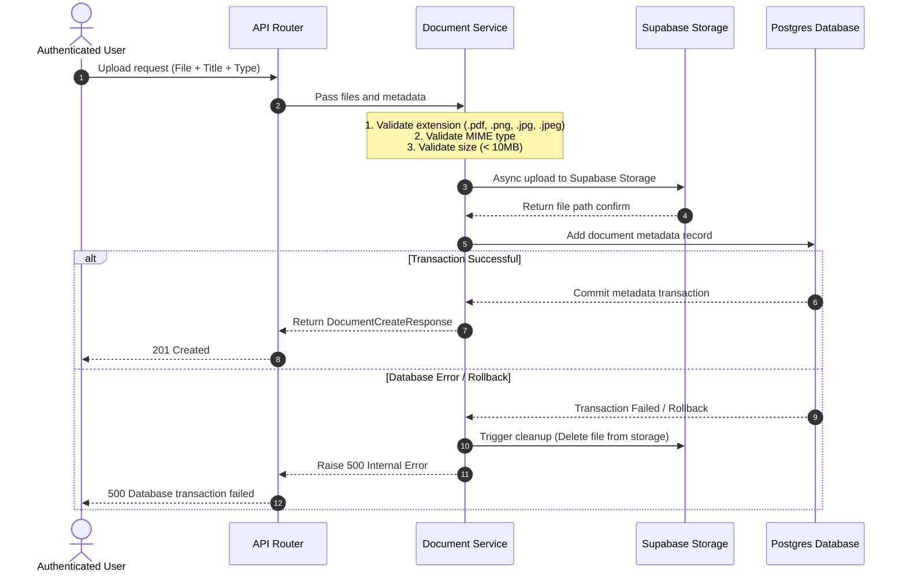

# Walkthrough: Document Management Module Backend Setup & Architecture

This guide describes how to configure, set up, and test the **Document Management Module** backend. It outlines everything from configuring Supabase Storage to understanding the core execution flows of the code.

---

## 1. Setup & Requirements

Before using or testing this module, the following configurations are required in your Supabase project and local environment.

### A. Supabase Project Configuration
1. Go to your **Supabase Dashboard** and navigate to **Storage**.
2. Click **New Bucket**.
3. Set the Name of the bucket to exactly: `vaultpass-documents`
4. Set the Bucket Privacy to **Private** (uncheck "Public"). 
   * *Why?* This ensures that documents (such as passports and certificates) are secure and cannot be accessed via public links. Only authorized users can download them through temporary signed URLs.

### B. Environment Variables Setup
You need a service role key to perform storage operations (like uploading, deleting, and signing URLs) from the backend while bypassing Supabase Row Level Security (RLS) policies.

1. Navigate to **Project Settings** > **API** in the Supabase Dashboard.
2. Locate the **Project URL** and the **`service_role` key** (labeled `service_role` / `secret`). *Do not use the `anon`/`public` key.*
3. Open or create the `vaultpass_backend/.env` file and add the settings:

```env
# Supabase Storage settings
SUPABASE_URL="https://your-supabase-project-id.supabase.co"
SUPABASE_SERVICE_ROLE_KEY="your-supabase-secret-service-role-key"
```

---

## 2. Database Schema & Migrations

The database table `documents` maps document metadata to PostgreSQL.

### Migration Discovery
The migration script is generated and located in:
[3fbdfb2d0dec_create_documents_table.py](file:///e:/gdev/projects/vault%20pass/vaultpass/vaultpass_backend/alembic/versions/3fbdfb2d0dec_create_documents_table.py)

### Applying Migrations
There are two ways to apply migrations:
1. **App Startup (Lifespan)**: The backend is configured to automatically apply Alembic migrations on startup in [main.py](file:///e:/gdev/projects/vault%20pass/vaultpass/vaultpass_backend/src/vaultpass_backend/main.py) via `run_migrations`. Simply run the FastAPI server, and it will update the schema automatically.
2. **Manual Command**: You can run migrations manually via terminal:
   ```bash
   poetry run alembic upgrade head
   ```

---

## 3. Core Architecture & Execution Flows

### A. File Upload Flow (`POST /api/documents/upload`)


* **Storage Path**: Files are saved in the bucket as `owner_id/uuid_filename` to prevent duplicates and path traversal attacks.
* **Error Cleanup**: If metadata saving fails after a file is uploaded, the service triggers an automatic cleanup task to delete the uploaded file from Supabase storage, preventing storage leakage.

### B. List Documents & Search Flow (`GET /api/documents`)
* Fetches all documents where `owner_id == current_user.id`.
* Supports pagination query parameters `page` and `limit`.
* Supports search filtering by document `title` utilizing case-insensitive matching (`ilike`):
  ```python
  search_filter = Document.title.ilike(f"%{search}%")
  ```

### C. Details & Download Link Flow (`GET /api/documents/{id}/download`)
* Checks ownership constraints: returns `403 Forbidden` if another user attempts to retrieve the document, or `404 Not Found` if it does not exist.
* Generates a secure, temporary (1-hour expiry) signed URL using Supabase:
  ```python
  signed_url = await storage_service.generate_signed_url(doc.file_path, expires_in_seconds=3600)
  ```

### D. Update Flow (`PUT /api/documents/{id}`)
* Validates ownership constraints.
* Allows updating details like `title`, `description`, `document_type`, or `expiry_date`.
* Updates only non-null fields to support partial modifications.

### E. Delete Flow (`DELETE /api/documents/{id}`)
* Validates ownership constraints.
* Deletes the file from Supabase Storage first.
* Deletes the metadata record from the Postgres database and commits the transaction.

---

## 4. How to Run the Tests

To ensure code stability, a comprehensive unit and integration test suite is located in [test_documents.py](file:///e:/gdev/projects/vault%20pass/vaultpass/vaultpass_backend/tests/test_documents.py). It mocks external APIs (like Supabase and connection interfaces) while verifying endpoint routers, file validations, page parameters, and owner access validations.

Run the test suite using Poetry:
```bash
poetry run pytest
```
All tests should pass successfully.
